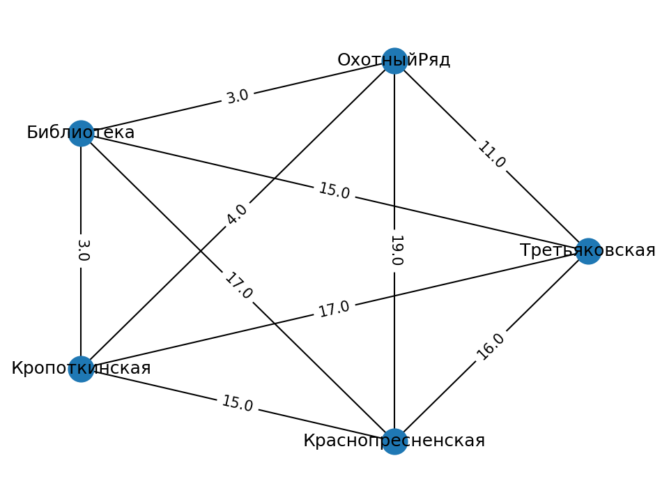

# Python часть решения

## Ключевые части

- [Данные по времени в пути](./data/paths.csv)
- [Матрица смежности графа](./data/results/adj.npy)
- [Конвертер из networkx.Graph в QUBO-матрицу](./solution/converters/tsp2qubo.py)
- [Итоговая QUBO-матрица](./data/results/Q.npy)
- [Найденный путь](./data/results/answer.csv)
- [Эффективный конвертер из networkx.Graph в QUBO-матрицу](./solution/service/solver/eff_tsp2qubo.py)

Вид исходного графа:

## Воспроизводимый запуск

- [Установить `poetry`](https://python-poetry.org/docs/#installation)
- Выполнить `make install_dev`
- Выполнить `make run_5_vertices KEY=%API key here%`

## Установка как пакета

- [Установить `poetry`](https://python-poetry.org/docs/#installation)
- Выполнить `make build_and_install_local`

## Py сервис

Тут будет описание
